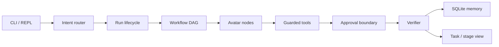

# avatars

**English** | [中文](README_cn.md)

[](LICENSE)
[](https://go.dev/)
[](#installation)

A CLI-first Go agent runtime for auditable, resumable, and verifier-gated task execution.

`avatars` turns a task into a lifecycle: inspectable transcripts, approval boundaries, and verifier verdicts. The goal is a **general-purpose agent operating system** — depth first, then breadth. The intended use is to drop the `avatars/` bundle into an existing repo or an empty project and keep it as a long-lived copilot, not to throw the binary onto the public internet as a cloud service.

```text
avatars run
  → run lifecycle
  → workflow DAG
  → avatar node execution
  → guarded tool action
  → approval boundary
  → approved continuation
  → verifier verdict
  → stable boundary
  → task / stage view
```

## Table of Contents

- [Why avatars](#why-avatars)
- [Features](#features)
- [Architecture](#architecture)
- [Capability levels](#capability-levels)
- [Requirements](#requirements)
- [Installation](#installation)
- [Configuration](#configuration)
- [Quick start](#quick-start)
- [CLI overview](#cli-overview)
- [Permission modes](#permission-modes)
- [Recommended layout](#recommended-layout)
- [Local servers](#local-servers)
- [Memory and records](#memory-and-records)
- [Development](#development)
- [Testing](#testing)
- [Security](#security)
- [Roadmap](#roadmap)
- [Documentation](#documentation)
- [Contributing](#contributing)
- [License](#license)

## Why avatars

Most coding agents treat a conversation as a single request/response. `avatars` treats a task as a workspace with a lifecycle:

- **Auditable**: JSONL transcripts, approval boundaries, and verifier records are persisted.
- **Resumable**: task workspaces, pause points, approval replay, and node retry.
- **Gated**: writes, patches, and shell commands go through a guarded pipeline. The runtime does not silently mutate the repo by default.
- **Concurrent**: a workflow DAG schedules role avatars (Planner / Researcher / Builder / Critic / Synthesizer). The LLM directs; Go runs the ready set.
- **Evolvable**: skills can be generated, reviewed, approved, and archived. SQLite records completions and pitfalls so later work does not break earlier capability.

## Features

- CLI-first: `avatars` / `avatars repl` use bounded natural-language routing, not a free-form shell.
- Full task pipeline: lifecycle → DAG → avatar → guarded tool → approval → verifier.
- Multi-provider LLM: DeepSeek, Anthropic, OpenAI, Gemini, OpenRouter, Qwen, Kimi, GLM, Ollama, LM Studio, and more. Keys live in environment variables only.
- Guarded tools: `read` / `write` / `patch` / `shell`. Dangerous commands are rejected; mutating work can require approval.
- SQLite-first memory: completions and hazards are written to SQLite (source of truth). `process_record.md` is a human/git export after a run.
- Skills governance: approved / generated / archived / disabled, with ledger, timeline, and reconcile.
- Local stage / serve / MCP: bound to `127.0.0.1` and token-gated.
- Plugin skills: `skills/*/SKILL.md` bundles listed in `.agents/plugins/marketplace.json` are visible to the runtime.

## Architecture



Role split (experimental surface):

| Role | Responsibility |
|------|----------------|
| Planner | Decompose the task, write the plan, define the DAG |
| Researcher | Read-only investigation; surveys may run in parallel |
| Builder | Edit code, call tools, land the implementation |
| Critic | Adversarial verification: try to break the work, not confirm that it looks fine |
| Synthesizer | Fold results into a stable boundary and a human-readable answer |

Static config is YAML. Mutable state is SQLite. Markdown exports exist for humans and git diffs. Deterministic guards (import validation, type conflicts, syntax checks) do not go through the LLM.

See [docs/avatars.md](docs/avatars.md) for module relationships.

## Capability levels

| Level | Scope |
|-------|-------|
| **stable** | CLI task workspaces, JSONL transcripts, guarded read/write/patch/shell, approval boundaries, approval replay for one persisted guarded action, lifecycle-derived task status, SQLite task memory, verifier records, and read-only stage/task inspection |
| **experimental** | Multi-avatar workflow DAG scheduling (including concurrent ready-set nodes such as parallel Researcher survey, capped by `max_parallel_avatars`), role-scoped avatar context, typed mailbox/handoff artifacts, generated skill candidates, skills governance, and richer stage governance. After a single node timeout/failure, sibling nodes in the same wave still finish; dependents of successful siblings can proceed. Retry a failed node with `tasks retry-node` or approval resume |
| **internal** | Event normalization, lifecycle evaluation indexes, hot-event summaries, telemetry snapshots, and verifier policy internals |
| **planned** | Plan-level `ParallelGroups` consumption for all roles, full in-place suspended-run resume across remaining workflow nodes, remote avatar execution, and marketplace-grade skill distribution |

Current limits:

- Approval replay re-executes the approved guarded request and updates the origin run lifecycle. It does **not** yet resume every remaining workflow node in place.
- Named permission mode `default` is experimental (interactive prompts are not implemented). Natural-language mutating work uses `acceptEdits`.
- Starting `avatars serve` does **not** turn the process into a cloud service. Put a process manager, reverse proxy, and authentication in front before exposing it.

## Requirements

- [Go 1.25+](https://go.dev/dl/)
- An API key for at least one LLM provider, injected via environment variable
- Windows / Linux / macOS

Optional:

- [Make](https://www.gnu.org/software/make/) (a `Makefile` lives at the repo root)
- Local models via Ollama or LM Studio

## Installation

Build from source at the repository root:

```powershell
go build -o .\bin\avatars.exe ./cmd/avatars
```

Unix:

```bash
go build -o ./bin/avatars ./cmd/avatars
```

Or use Make:

```bash
make build
```

The binary lands in `bin/` (gitignored). Do not double-click `avatars.exe`. This is a CLI-first runtime and expects arguments or the REPL. Put the binary on `PATH` if you want to type `avatars` directly.

Copy a freshly built binary into the target project's bundle before testing:

```text
target-project/avatars/bin/avatars.exe
```

## Configuration

1. Copy the example config (`configs/agent.yaml` is gitignored):

   ```powershell
   Copy-Item configs\agent.yaml.example configs\agent.yaml
   ```

   ```bash
   cp configs/agent.yaml.example configs/agent.yaml
   ```

2. Set `llm.active_provider` and the matching `api_key_env` in `configs/agent.yaml`.
3. **Do not** put plaintext `api_key` values in YAML.

```yaml
llm:
  active_provider: deepseek
  api_key_env: DEEPSEEK_API_KEY
  base_url: https://api.deepseek.com
```

Then export the environment variable, for example:

```powershell
$env:DEEPSEEK_API_KEY = "your-key"
```

```bash
export DEEPSEEK_API_KEY="your-key"
```

Built-in providers include `deepseek`, `anthropic`, `openai`, `google`, `openrouter`, `qwen`, `kimi`, `glm`, `doubao`, `nvidia`, `agnes`, `mistral`, `ollama`, `lm-studio`, `minimax`, `mimo`, and `custom-compatible`. Inspect the local catalog with:

```powershell
.\bin\avatars.exe llm providers
.\bin\avatars.exe llm show deepseek
```

Feature flags: only `features.memory` is a real runtime switch (SQLite hot-memory). Legacy `features.stage` / `features.skills` keys are ignored if still present; stage/serve and the skill store always load.

Runtime assets resolve in this order: `AVATARS_HOME` → `.\avatars\` → repository root paths. Task state always stays in the target project's `.avatars/` directory (transcripts, memory, approvals, verifier reports, task workspaces).

```powershell
$env:AVATARS_HOME = "D:\path\to\target-project\avatars"
```

```bash
export AVATARS_HOME="/path/to/target-project/avatars"
```

## Quick start

From the repository root, or from the target project root (recommended):

```powershell
# Health check
.\bin\avatars.exe verify

# Read-only analysis (no file mutations)
.\bin\avatars.exe run --new-task --permission-mode plan "Analyze this repository and summarize issues in ana.md"

# Allow edits (guarded / acceptEdits)
.\bin\avatars.exe run --task repo-refactor --permission-mode acceptEdits "Propose and apply a focused refactor"

# Start from a markdown plan
.\bin\avatars.exe run --new-task --from-file plan.md

# Interactive REPL (bare avatars also enters REPL)
.\bin\avatars.exe
.\bin\avatars.exe repl --task repo-analysis --display compact
```

Inside the REPL:

- `/help` lists REPL commands
- `/load plan.md` or `@plan.md` feeds a plan file
- Natural language is classified first: `direct_answer` / `memory_answer` / `safe_run` / `clarify` / `guarded`
- Read-only questions default to `--permission-mode plan`; explicit coding writes use `acceptEdits`
- `/exit` leaves the loop

## CLI overview

The full command surface is in [CLI_guide.md](CLI_guide.md). The machine-readable action map is `configs/cli_actions.yaml`, used for LLM routing.

| Command | Purpose |
|---------|---------|
| `avatars` / `avatars repl` | Bounded interactive loop |
| `avatars run` | Execute a task through the full avatar pipeline |
| `avatars intent` | Route natural language or `--from-file` into a bounded command |
| `avatars tasks list\|show\|approve\|deny\|retry-node\|delete` | Task workspaces and approvals |
| `avatars memory status\|maintain\|archive-*` | SQLite memory maintenance |
| `avatars skills list\|review\|approve\|archive\|...` | Skills governance |
| `avatars verify` | Run verification on generated code |
| `avatars serve` | Local operator / event dashboard |
| `avatars stage` | Creative HTML gallery (not code delivery; not `serve`) |
| `avatars mcp list\|show\|inspect\|call\|serve` | MCP client / local MCP server |
| `avatars llm providers\|show` | Provider catalog |
| `avatars arch analyze\|init\|check` | Project architecture analysis |
| `avatars plugins list` | Local plugin skill bundles |
| `avatars write` / `patch` / `shell` / `git` | Bounded file and git primitives |

Common flags:

- `--task <id>` bind an existing workspace
- `--new-task` open a fresh workspace
- `--from-file <path>` load the task/plan from markdown
- `--permission-mode <mode>` see the next section
- `--resume <transcript-path>` continue from a transcript

## Permission modes

| Mode | Behavior |
|------|----------|
| `plan` | Read-only analysis / planning; no repo mutations |
| `acceptEdits` | Default path for natural-language file changes; writes go through guarded / approval |
| `default` | Experimental; interactive prompts are not implemented |
| `dontAsk` / `bypassPermissions` | High-privilege modes; use only when you accept the consequences |

## Recommended layout

Keep `avatars` as a long-lived copilot inside the target project:

```text
target-project/
  avatars/
    bin/              # avatars.exe
    configs/          # agent.yaml (local, not committed)
    skills/
    web/
    CLI_guide.md
  .avatars/           # project-local state: transcripts / memory / approvals
```

Run from the **target-project root**, for example:

```powershell
.\avatars\bin\avatars.exe "Analyze this project, find issues, do not modify files, summarize in ana.md"
```

Default repository survey ignores the bundled `avatars/` directory so runtime files such as `avatars/configs/agent.yaml` are not mistaken for target-project source evidence.

Design notes:

1. Multiple avatars, with the LLM as director; Go concurrency runs the ready set.
2. Self-iterating skill guides should cover roles and new complex tasks: one skill per avatar; write a skill before a new hard job.
3. Context memory uses SQLite as the source of truth. Do not let markdown drive the runtime.
4. `process_record.md` is a post-run export for humans and git. It is **not** a startup read path for the LLM.

## Local servers

`avatars serve`, `avatars stage --serve`, and `avatars mcp serve` bind `127.0.0.1` and require a token:

- Stage / serve: `AVATARS_STAGE_TOKEN` (a one-shot session token is printed if unset)
- MCP: `AVATARS_MCP_TOKEN`

`serve` does not auto-run a demo task unless `--run-demo` is passed. The stage server currently listens on `http://127.0.0.1:5000`. Add a process manager, reverse proxy, and authentication layer before treating it as a real cloud service.

```powershell
.\bin\avatars.exe serve --task repo-refactor "Continue repository inspection"
```

## Memory and records

Write path:

1. `RecordTaskCompletion()` → SQLite `evaluation_records` (source of truth)
2. Pitfalls / hazards → SQLite `warm_lessons`
3. End of run → regenerate `process_record.md` from SQLite (read-only export)

The read path uses SQLite snapshots / warm lessons / plan+todo. Runtime code **never** reads `process_record.md`.

| Table | Purpose |
|-------|---------|
| `evaluation_records` | Task completion verdicts (PASS / FAIL / PARTIAL), Jaccard ≥ 0.7 dedup |
| `warm_lessons` | Cross-session pitfalls, expired by task_id and confidence |
| `evolution_candidates` | Skill promotion candidates |

Related commands: `avatars memory status`, `avatars memory maintain --dry-run`, `avatars governance status`.

## Development

```powershell
go test ./...
go test -race ./...
go vet ./...
go fmt ./...
```

Make targets: `build`, `test`, `test-race`, `vet`, `fmt`, `run`.

Secret scan:

```powershell
powershell -File scripts\secret_scan.ps1
```

Production layout:

```text
cmd/avatars/          # CLI entry, REPL, intent routing
internal/runtime/     # main loop, DAG, approval, verifier glue
internal/workflow/    # plans, phases, todos, delivery locks
internal/llm/         # providers, tool loop, path jail
internal/memory/      # SQLite store
internal/skills/      # builtin + governance
internal/stage/       # local HTTP / SSE
configs/              # agent.yaml.example, cli_actions.yaml
skills/approved/      # approved skills
docs/                 # architecture and planning entry
```

`claude_code_main/`, `*_for_test/`, and expanding the `web/stage` product surface are not current production dependencies. Do not rewrite `internal/runtime`, add remote avatars, or publicly serve without a token.

## Testing

Capability work is additive. Do not strip existing guards to pass a single task. Record completed work and hazards in SQLite / exported `process_record.md` so later edits do not silently kill earlier behavior.

The repo ships disposable fixture trees:

- `sheetforge_for_Test/` — a populated test project
- `new_project_for_test/` — an empty-project scaffold

Copy a newly built `avatars.exe` into the fixture `avatars/bin/` directory, then run from the fixture root:

```powershell
Copy-Item .\bin\avatars.exe .\sheetforge_for_Test\avatars\bin\avatars.exe -Force
Set-Location .\sheetforge_for_Test
.\avatars\bin\avatars.exe verify
```

These directories may be edited or deleted freely. Do not treat them as production dependencies.

## Security

- Keep API keys in environment variables. Do not commit `configs/agent.yaml`.
- Guarded shell and `shell_done` share the same command validation.
- Local HTTP / MCP default to loopback plus a token.
- The stage server is not a public product surface.
- If a key leaks: rotate it and run `scripts/secret_scan.ps1`.

Do not commit `bypassPermissions`, an unauthenticated `serve`, or plaintext keys.

## Roadmap

Current baseline: CLI workspaces, guarded tools, approval, SQLite memory, verifier, skills governance, and local serve/stage.

Next (planned, not a current commitment):

- Plan-level `ParallelGroups` consumption for all roles
- In-place suspended-run resume across remaining workflow nodes
- Remote avatar execution
- Marketplace-grade skill distribution

Explicitly out of scope: rewriting `internal/runtime`, adding new roles, or public serve without authentication.

## Documentation

| Doc | Contents |
|-----|----------|
| [README_cn.md](README_cn.md) | Chinese README |
| [CLI_guide.md](CLI_guide.md) | Full CLI guide (kept current) |
| [docs/avatars.md](docs/avatars.md) | Architecture and planning entry |
| [configs/cli_actions.yaml](configs/cli_actions.yaml) | LLM bounded action map |
| [configs/agent.yaml.example](configs/agent.yaml.example) | Config template |

## Contributing

1. Read [CLI_guide.md](CLI_guide.md) and [docs/avatars.md](docs/avatars.md) first.
2. Keep changes additive: add tests or a reproducible check. Do not strip existing guards to finish one task.
3. Record completions and hazards in SQLite / `process_record.md` terms, and keep `coding_plan.md` in sync.
4. Before a commit: `go test ./...`, `go vet ./...`, and `scripts/secret_scan.ps1` when config is involved.
5. Do not commit `configs/agent.yaml`, `.avatars/`, `bin/`, or secrets.

Issues and PRs should include the reproduce command, permission mode, task id, and a redacted transcript / verifier summary from `.avatars/`.

## License

Copyright 2026 The avatars Authors.

Licensed under the [Apache License, Version 2.0](LICENSE).
You may not use this file except in compliance with the License.
You may obtain a copy of the License at

<http://www.apache.org/licenses/LICENSE-2.0>

Unless required by applicable law or agreed to in writing, software
distributed under the License is distributed on an "AS IS" BASIS,
WITHOUT WARRANTIES OR CONDITIONS OF ANY KIND, either express or implied.
See the License for the specific language governing permissions and
limitations under the License.

See also [NOTICE](NOTICE).
