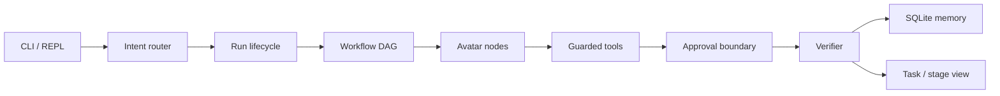

# avatars

**English** | [中文](README_cn.md)

[](LICENSE)
[](https://go.dev/)
[](#installation)

A CLI-first Go agent runtime for auditable, resumable, and verifier-gated task execution.

`avatars` 是一个以 CLI 为先的 Go agent 运行时：把一次任务拆成可审计、可恢复、经 verifier 门控的执行过程。目标是做成**通用型 agent 操作系统**——先挖深度，再扩广度。推荐用法是把整个 `avatars/` 包放进已有仓库或空项目，作为长期副驾，而不是把二进制丢到云上当公共服务。

```text
avatars run
  → run lifecycle
  → workflow DAG
  → avatar node execution
  → guarded tool action
  → approval boundary
  → approved continuation
  → verifier verdict
  → stable boundary
  → task / stage view
```

## 目录

- [为什么选择 avatars](#为什么选择-avatars)
- [功能](#功能)
- [架构](#架构)
- [能力分层](#能力分层)
- [环境要求](#环境要求)
- [安装](#安装)
- [配置](#配置)
- [快速开始](#快速开始)
- [CLI 总览](#cli-总览)
- [权限模式](#权限模式)
- [推荐目录布局](#推荐目录布局)
- [本机服务](#本机服务)
- [Memory 与记录](#memory-与记录)
- [开发](#开发)
- [测试](#测试)
- [安全](#安全)
- [路线图](#路线图)
- [文档](#文档)
- [贡献](#贡献)
- [许可证](#许可证)

## 为什么选择 avatars

多数 coding agent 把一次对话当成一次请求/响应。`avatars` 把任务当成有生命周期的工作空间：

- **可审计**：JSONL transcript、审批边界、verifier 记录都落盘。
- **可恢复**：任务 workspace、pause-point、approval replay、node retry。
- **可门控**：写文件 / patch / shell 走 guarded pipeline，默认不静默改仓库。
- **可并发**：workflow DAG 调度多个角色 avatar（Planner / Researcher / Builder / Critic / Synthesizer），由 LLM 总导演，Go 负责并发。
- **可进化**：skills 可生成、评审、批准、归档；SQLite 记下完成项与隐患，避免拆东墙补西墙。

## 功能

- CLI-first：`avatars` / `avatars repl` 走有界自然语言路由，不是自由 shell。
- 完整任务流水线：lifecycle → DAG → avatar → guarded tool → approval → verifier。
- 多 provider LLM：DeepSeek、Anthropic、OpenAI、Gemini、OpenRouter、Qwen、Kimi、GLM、Ollama、LM Studio 等；密钥只走环境变量。
- Guarded tools：`read` / `write` / `patch` / `shell`，危险命令拒绝，写操作可要求审批。
- SQLite-first memory：完成项与隐患写入 SQLite（SoT）；`process_record.md` 只是跑完后的人读/git 镜像。
- Skills 治理：approved / generated / archived / disabled，带 ledger、timeline、reconcile。
- 本地 stage / serve / MCP：默认绑定 `127.0.0.1`，必须带 token。
- 插件技能：`.agents/plugins/marketplace.json` 中的 `skills/*/SKILL.md` 可被运行时看见。

## 架构



角色分工（当前实验面）：

| Role | 职责 |
|------|------|
| Planner | 拆任务、写计划、定义 DAG |
| Researcher | 只读调研，可并行 survey |
| Builder | 改代码、调工具、落地实现 |
| Critic | 对抗式核验，尝试打破实现而不是确认它“看起来能过” |
| Synthesizer | 汇总结论、稳定边界、给人读的答案 |

静态配置用 YAML；可变状态用 SQLite；markdown 导出给人读和 git diff。确定性守卫（import 校验、类型冲突、语法检查）不经过 LLM。

更细的模块关系见 [docs/avatars.md](docs/avatars.md)。

## 能力分层

| Level | 范围 |
|-------|------|
| **stable** | CLI 任务 workspace、JSONL transcript、guarded read/write/patch/shell、approval 边界、单次 persisted guarded action 的 approval replay、由 lifecycle 推导的任务状态、SQLite task memory、verifier 记录、只读 stage/task 查看 |
| **experimental** | 多 avatar workflow DAG（含并发 ready-set，例如并行 Researcher survey，受 `max_parallel_avatars` 上限约束）、角色作用域上下文、typed mailbox/handoff、生成 skill 候选、skills 治理、更丰富的 stage governance。单个 node 超时/失败后，同波次兄弟节点仍会跑完；成功兄弟的依赖可继续。失败节点用 `tasks retry-node` 或 approval resume |
| **internal** | event normalization、lifecycle evaluation indexes、hot-event summaries、telemetry snapshots、verifier policy 内部实现 |
| **planned** | 全角色消费 plan-level `ParallelGroups`、剩余 workflow nodes 的原地 suspended-run resume、远程 avatar 执行、marketplace 级 skill 分发 |

当前限制：

- Approval replay 会重放已批准的 guarded 请求并更新 origin run lifecycle，**尚未**原地恢复后续每一个 workflow node。
- 命名权限模式 `default` 仍是 experimental（交互式 prompt 未实现）。自然语言改文件默认走 `acceptEdits`。
- `avatars serve` **不会**仅仅因为启动了进程就变成云服务。公网暴露前必须有进程管理、反向代理和鉴权。

## 环境要求

- [Go 1.25+](https://go.dev/dl/)
- 至少一个 LLM provider 的 API key（通过环境变量注入）
- Windows / Linux / macOS

可选：

- [Make](https://www.gnu.org/software/make/)（仓库根有 `Makefile`）
- 本地模型：Ollama 或 LM Studio

## 安装

从源码构建（在仓库根目录）：

```powershell
go build -o .\bin\avatars.exe ./cmd/avatars
```

Unix:

```bash
go build -o ./bin/avatars ./cmd/avatars
```

或使用 Make：

```bash
make build
```

构建产物默认在 `bin/`（已 gitignore）。不要双击 `avatars.exe`：这是 CLI-first 运行时，需要参数或 REPL。把二进制放到 `PATH` 后才能直接敲 `avatars`。

把新构建的二进制拷进目标项目的 bundle 后再测：

```text
target-project/avatars/bin/avatars.exe
```

## 配置

1. 复制示例配置（`configs/agent.yaml` 已被 gitignore）：

   ```powershell
   Copy-Item configs\agent.yaml.example configs\agent.yaml
   ```

2. 在 `configs/agent.yaml` 里设置 `llm.active_provider` 和对应的 `api_key_env`。
3. **不要**把明文 `api_key` 写进 YAML。

```yaml
llm:
  active_provider: deepseek
  api_key_env: DEEPSEEK_API_KEY
  base_url: https://api.deepseek.com
```

然后导出环境变量，例如：

```powershell
$env:DEEPSEEK_API_KEY = "your-key"
```

内置 provider 包括 `deepseek`、`anthropic`、`openai`、`google`、`openrouter`、`qwen`、`kimi`、`glm`、`doubao`、`nvidia`、`agnes`、`mistral`、`ollama`、`lm-studio`、`minimax`、`mimo`、`custom-compatible`。用下面命令查看当前机器上的目录：

```powershell
.\bin\avatars.exe llm providers
.\bin\avatars.exe llm show deepseek
```

Feature flags：只有 `features.memory` 是真实运行时开关（SQLite hot-memory）。遗留的 `features.stage` / `features.skills` 即使还在 YAML 里也会被忽略；stage/serve 和 skill store 始终加载。

运行时资源解析顺序：`AVATARS_HOME` → `.\avatars\` → 仓库根路径。任务状态始终落在目标项目的 `.avatars/`（transcript、memory、approvals、verifier、task workspace）。

```powershell
$env:AVATARS_HOME = "D:\path\to\target-project\avatars"
```

## 快速开始

在仓库根，或目标项目根（推荐）：

```powershell
# 健康检查
.\bin\avatars.exe verify

# 只读分析（不改文件）
.\bin\avatars.exe run --new-task --permission-mode plan "Analyze this repository and summarize issues in ana.md"

# 允许编辑（走 approval / acceptEdits）
.\bin\avatars.exe run --task repo-refactor --permission-mode acceptEdits "Propose and apply a focused refactor"

# 从 markdown 计划启动
.\bin\avatars.exe run --new-task --from-file plan.md

# 交互 REPL（无参数时同样进入 REPL）
.\bin\avatars.exe
.\bin\avatars.exe repl --task repo-analysis --display compact
```

REPL 里：

- `/help` 查看命令
- `/load plan.md` 或 `@plan.md` 喂计划文件
- 自然语言先走分类器：`direct_answer` / `memory_answer` / `safe_run` / `clarify` / `guarded`
- 只读问题默认 `--permission-mode plan`；明确改代码走 `acceptEdits`
- `/exit` 离开

## CLI 总览

完整指令见 [CLI_guide.md](CLI_guide.md)。机器可读动作表在 `configs/cli_actions.yaml`，给 LLM 路由用。

| Command | 用途 |
|---------|------|
| `avatars` / `avatars repl` | 有界交互循环 |
| `avatars run` | 走完整 avatar pipeline 执行任务 |
| `avatars intent` | 把自然语言或 `--from-file` 路由到有界命令 |
| `avatars tasks list\|show\|approve\|deny\|retry-node\|delete` | 任务工作空间与审批 |
| `avatars memory status\|maintain\|archive-*` | SQLite memory 维护 |
| `avatars skills list\|review\|approve\|archive\|...` | skills 治理 |
| `avatars verify` | 对生成代码跑 verification |
| `avatars serve` | 本机 operator / event dashboard |
| `avatars stage` | 创意 HTML gallery（不是代码交付，也不是 `serve`） |
| `avatars mcp list\|show\|inspect\|call\|serve` | MCP 客户端 / 本机 MCP server |
| `avatars llm providers\|show` | provider 目录 |
| `avatars arch analyze\|init\|check` | 项目架构分析 |
| `avatars plugins list` | 本地 plugin skill bundles |
| `avatars write` / `patch` / `shell` / `git` | 有界文件与 git 原语 |

常用 flags：

- `--task <id>` 绑定已有 workspace
- `--new-task` 开新 workspace
- `--from-file <path>` 从 markdown 读任务/计划
- `--permission-mode <mode>` 见下一节
- `--resume <transcript-path>` 从 transcript 续跑

## 权限模式

| Mode | 行为 |
|------|------|
| `plan` | 只读分析 / 规划，不改仓库 |
| `acceptEdits` | 自然语言改文件的默认路径；写操作走 guarded / approval |
| `default` | experimental；交互式 prompt 尚未实现 |
| `dontAsk` / `bypassPermissions` | 高权限模式，仅在你明确知道后果时使用 |

## 推荐目录布局

把 `avatars` 当作目标项目里的长期副驾：

```text
target-project/
  avatars/
    bin/              # avatars.exe
    configs/          # agent.yaml（本地，不入库）
    skills/
    web/
    CLI_guide.md
  .avatars/           # 项目本地状态：transcript / memory / approvals
```

从 **target-project 根** 运行，例如：

```powershell
.\avatars\bin\avatars.exe "Analyze this project, find issues, do not modify files, summarize in ana.md"
```

默认仓库 survey 会忽略 bundle 目录 `avatars/`，避免把运行时自己的 `configs/agent.yaml` 当成目标项目源码证据。

核心设计提醒：

1. 多 avatar 分身，LLM 当总导演；用 Go 的并发跑 ready-set。
2. 自迭代 skills 指导书尽量覆盖角色与新复杂任务：每个 avatar 配一份 skill；用户新任务先写 skill。
3. 上下文 memory 以 SQLite 为 SoT，合理读写，不要让 markdown 倒过来驱动运行时。
4. `process_record.md` 是跑完后的导出镜像，供人读 / git；**不是** LLM 启动读路径。

## 本机服务

`avatars serve`、`avatars stage --serve`、`avatars mcp serve` 都绑定 `127.0.0.1`，并要求 token：

- Stage / serve：`AVATARS_STAGE_TOKEN`（未设置时会打印一次性 session token）
- MCP：`AVATARS_MCP_TOKEN`

`serve` 不会自动跑 demo 任务，除非显式传入 `--run-demo`。当前 stage 默认监听 `http://127.0.0.1:5000`。把它当成云服务之前，先加进程管理、反向代理和认证层。

```powershell
.\bin\avatars.exe serve --task repo-refactor "Continue repository inspection"
```

## Memory 与记录

写入路径：

1. `RecordTaskCompletion()` → SQLite `evaluation_records`（SoT）
2. 隐患 / 坑 → SQLite `warm_lessons`
3. 任务结束 → 从 SQLite 再生成 `process_record.md`（只读导出）

读取路径走 SQLite snapshot / warm lessons / plan+todo，**运行时代码从不读** `process_record.md`。

| Table | 用途 |
|-------|------|
| `evaluation_records` | 任务完成 verdict（PASS / FAIL / PARTIAL），Jaccard ≥ 0.7 去重 |
| `warm_lessons` | 跨 session 隐患，按 task_id、confidence 过期 |
| `evolution_candidates` | skill 晋升候选 |

相关命令：`avatars memory status`、`avatars memory maintain --dry-run`、`avatars governance status`。

## 开发

```powershell
go test ./...
go test -race ./...
go vet ./...
go fmt ./...
```

Make 目标：`build`、`test`、`test-race`、`vet`、`fmt`、`run`。

密钥扫描：

```powershell
powershell -File scripts\secret_scan.ps1
```

包结构（生产代码）：

```text
cmd/avatars/          # CLI 入口、REPL、intent 路由
internal/runtime/     # 主循环、DAG、approval、verifier 衔接
internal/workflow/    # 计划、phase、todo、交付锁
internal/llm/         # provider、tool loop、path jail
internal/memory/      # SQLite store
internal/skills/      # builtin + governance
internal/stage/       # 本机 HTTP / SSE
configs/              # agent.yaml.example、cli_actions.yaml
skills/approved/      # 已批准 skill
docs/                 # 架构与规划入口
```

`claude_code_main/`、`*_for_test/`、`web/stage` 产品面扩张不作为当前生产依赖。不要重写 `internal/runtime`、不要加远程 avatar、不要无 token 公网 serve。

## 测试

功能完善是加法，禁止拆东墙补西墙。已完成功能与隐患记入 SQLite / 导出的 `process_record.md`，避免后续改动把先前能力改坏。

仓库提供可随意破坏的夹具树：

- `sheetforge_for_Test/` — 有内容的测试项目
- `new_project_for_test/` — 空项目脚手架

新构建的 `avatars.exe` 先复制到夹具的 `avatars/bin/`，再从夹具根运行：

```powershell
Copy-Item .\bin\avatars.exe .\sheetforge_for_Test\avatars\bin\avatars.exe -Force
Set-Location .\sheetforge_for_Test
.\avatars\bin\avatars.exe verify
```

这些目录可以大胆改、大胆删。不要把它们当成生产依赖。

## 安全

- API key 只放环境变量；`configs/agent.yaml` 不入库。
- Guarded shell 与 `shell_done` 共用同一套命令校验。
- 本机 HTTP / MCP 默认 loopback + token。
- Stage server 不是公网产品面。
- 发现密钥泄漏：轮换 key，并跑 `scripts/secret_scan.ps1`。

不要把 `bypassPermissions`、无 token 的 `serve`、或明文 key 提交进 git。

## 路线图

已成型基线：CLI workspace、guarded tools、approval、SQLite memory、verifier、skills 治理、本机 serve/stage。

下一步（planned，不是当前承诺）：

- 全角色消费 plan-level `ParallelGroups`
- 剩余 workflow nodes 的原地 suspended-run resume
- 远程 avatar 执行
- marketplace 级 skill 分发

明确不做：重写 `internal/runtime`、新开角色、无鉴权公网 serve。

## 文档

| Doc | 内容 |
|-----|------|
| [README.md](README.md) | English README |
| [CLI_guide.md](CLI_guide.md) | 完整 CLI 说明书（持续更新） |
| [docs/avatars.md](docs/avatars.md) | 架构与规划入口 |
| [configs/cli_actions.yaml](configs/cli_actions.yaml) | LLM 有界动作表 |
| [configs/agent.yaml.example](configs/agent.yaml.example) | 配置模板 |

## 贡献

1. 先读 [CLI_guide.md](CLI_guide.md) 和 [docs/avatars.md](docs/avatars.md)。
2. 改功能时保持加法：补测试或可复现验收，不要为了过单项任务拆掉既有守卫。
3. 完成项与隐患写入 SQLite / `process_record.md` 口径，并同步 `coding_plan.md`。
4. 提交前：`go test ./...`、`go vet ./...`，涉及配置时跑 `scripts/secret_scan.ps1`。
5. 不要提交 `configs/agent.yaml`、`.avatars/`、`bin/`、或任何密钥。

Issue / PR 请写清：复现命令、permission mode、task id、以及 `.avatars/` 里相关 transcript / verifier 摘要（注意打码密钥）。

## 许可证

Copyright 2026 The avatars Authors.

Licensed under the [Apache License, Version 2.0](LICENSE).
You may not use this file except in compliance with the License.
You may obtain a copy of the License at

<http://www.apache.org/licenses/LICENSE-2.0>

Unless required by applicable law or agreed to in writing, software
distributed under the License is distributed on an "AS IS" BASIS,
WITHOUT WARRANTIES OR CONDITIONS OF ANY KIND, either express or implied.
See the License for the specific language governing permissions and
limitations under the License.

See also [NOTICE](NOTICE).
